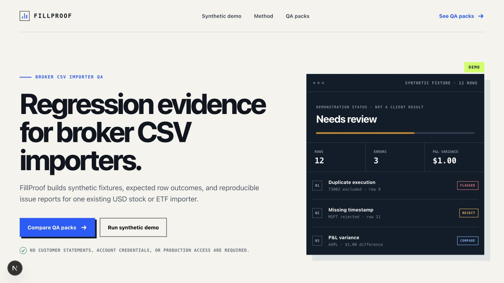

# FillProof

FillProof is a browser-local QA demonstration for USD cash-equity CSV importers. It turns a synthetic execution fixture into explicit accepted, rejected, and calculation-excluded rows; reconstructs supported flat-to-flat round trips; and exports source-linked findings for regression work.

> Portfolio status: this repository uses synthetic data and demonstrates an engineering workflow. It is not a client result, a broker integration, a trading system, or financial advice.



## What it demonstrates

- Deterministic CSV parsing with canonical header aliases, duplicate-column detection, row-width checks, UTF-8 safeguards, and formula-safe CSV export.
- Fail-closed validation for timestamps, numeric formats, fees, instruments, currencies, duplicate execution IDs, open positions, and position flips.
- Partial-fill grouping and flat-to-flat round-trip reconstruction with source-row provenance preserved through every finding.
- A responsive React interface with issue filters, an inspector, round-trip results, local file input, and downloadable review output.
- Nineteen automated regression tests plus a production build and ESLint verification.

## Safety and scope

The demo processes files in the browser and ships with an intentionally defective synthetic fixture. It does not upload a CSV, connect to a broker, request credentials, place trades, calculate tax lots, or support options, futures, forex, crypto, multiple currencies, starting inventory outside the file, or executions that flip through zero.

Only synthetic or deliberately altered data should be used with this portfolio build.

## Request fixed-scope QA

For one existing USD stock/ETF CSV importer, open a [scoped request](https://github.com/Alina-Alx/fillproof-csv-audit-demo/issues/new?title=Scoped%20CSV%20importer%20QA%20request) with the broker/export name and header row only. The $79 mini scope covers one known failure mode; the $150 full scope covers a broader agreed regression matrix. Fit, inputs, observation path, and deliverables are confirmed before payment. Never post credentials, account data, or production statements.

## Run locally

Requirements: Node.js 22.13 or newer.

```bash
npm ci
npm run dev
```

Open `http://localhost:3000`.

## Verify

```bash
npm test
npm run lint
```

`npm test` creates a production build and runs the Node test suite. The tests cover invalid rows, duplicate IDs, aliases, canonical-header collisions, account-scoped identity, position flips, blank lines, ambiguous number formats, P&L provenance, missing fees and timezones, unsupported instruments, spreadsheet-formula neutralization, malformed quoting, and undecodable input.

## Expected CSV

Required columns:

```text
execution_id,order_id,timestamp,account,asset_type,currency,
symbol,side,quantity,price,commission
```

Optional columns are `setup`, `planned_risk_usd`, `risk_limit_usd`, and `reported_net_pnl`. Timestamps require an explicit UTC offset, commissions cannot be blank, and confirmed `reported_net_pnl` belongs only on the closing execution of a flat-to-flat trade.

The downloadable fixture is [`public/sample-executions.csv`](public/sample-executions.csv).

## Structure

| Path | Responsibility |
| --- | --- |
| `app/page.tsx` | Interactive audit UI and local-file workflow |
| `lib/trade-audit.mjs` | Parser, validation, reconstruction, findings, and CSV export |
| `tests/trade-audit.test.mjs` | Domain and edge-case regression tests |
| `tests/rendered-html.test.mjs` | Production-output smoke checks |
| `public/sample-executions.csv` | Synthetic demonstration fixture |

## Fixed-scope QA workflow

The service illustrated by the demo starts with one existing importer and one agreed observation path: a runnable repository/build, a staging importer, or unedited outputs from client-run fixtures. The deliverable is a synthetic fixture, expected outcomes, a source-linked issue list, and a rerun after the importer changes. Production access, customer statements, credentials, and unsupported asset classes remain out of scope.
